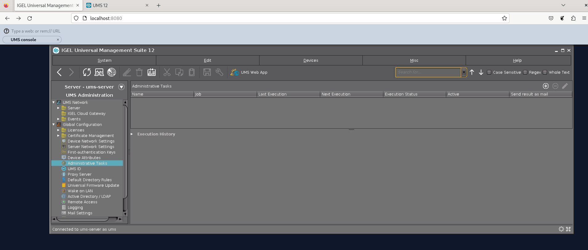
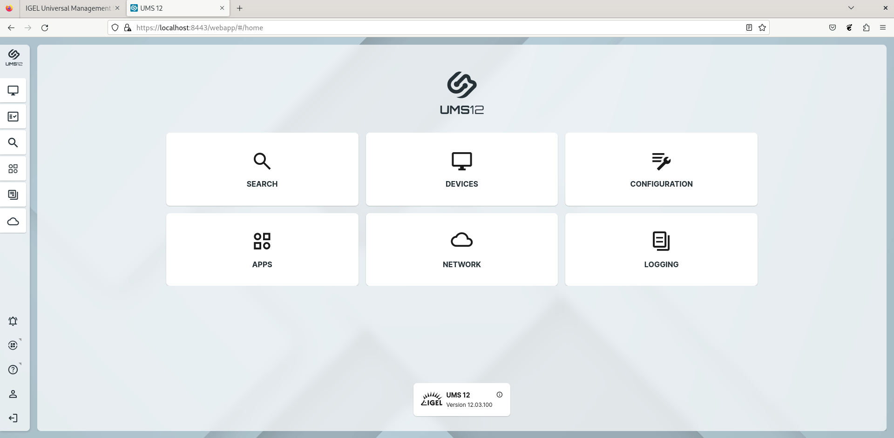

# Motivation
The motivation to run UMS in a docker container was to automate intehration test so it is
possible to set up a UMS exactly for one test and afterwards throw it away which would allow easy reproducable tests.

Another goal was to easily run different versions of the UMS

# Architecture
The project contains 2 docker container one for the UMS Console and one for the UMS Server including the WebApp.
In order to access the UMS Console the [greenfield HTML5 wayland compositor](https://github.com/udevbe/greenfield) is used.
This allows to render any legacy X11 or wayland application into a browser.

# Getting started
First we need to compile the greenfield project which is included as a git submodule.
This can be done by running the `./build_greenfield.sh` this command needs to be run after updating the greenfield project.

After the compilation was successfull the UMS Console and Server docker containers need to build which can
be done via `docker compose`. Before building the required UMS version needs to be downloaded from [www.igel.com](https://www.igel.com/igel-solution-family/universal-management-suite/)
amd copied to the `ums-docker` dir please download. After downloading the containers can be build with
`docker-compose build --build-arg ums_version=12.03.100`, the `ums-version` build-arg must match the version you have
downloaded.
If build was successfull the containers can be run via `docker-compose up -d`.

If all is up and running spin up your favorite browser (if run from a VM without hardware acceleration use Firefox
because Chromium seems to disable WebGL if only software rendering is available).

To connect to the Conosole navigate to http://localhost:8080/ and enter `rem://localhost:8081/console` into the compositor URL bar.

To connect to the WebUMS navigate to https://localhost:8443/webapp/#/home

## Default credentials
Username: `ums`

Password `ums`

# Current problems
The greenfield compositor is a bit unstable with the UMS console if a new window is opened it might freeze
and lose connection if this happens the side needs to be reloaded. This might be needed 3 - 5 times until the UMS Console is shown.

To get it even running within greenfield I needed to hack around a problem that the compositor closed
the Console after the splash screen this might be because for a short amount of time there is no active X11
connection and the compositor takes this as a signal that the app was closed.

# ToDos
- Find out what files need to be persistent on UMS server and mount them to a folder outside the container
- Improve stability of greenfield (already started a discussion in the upstream project)
- Add environment variables to allow configuring UMS installation parameters
